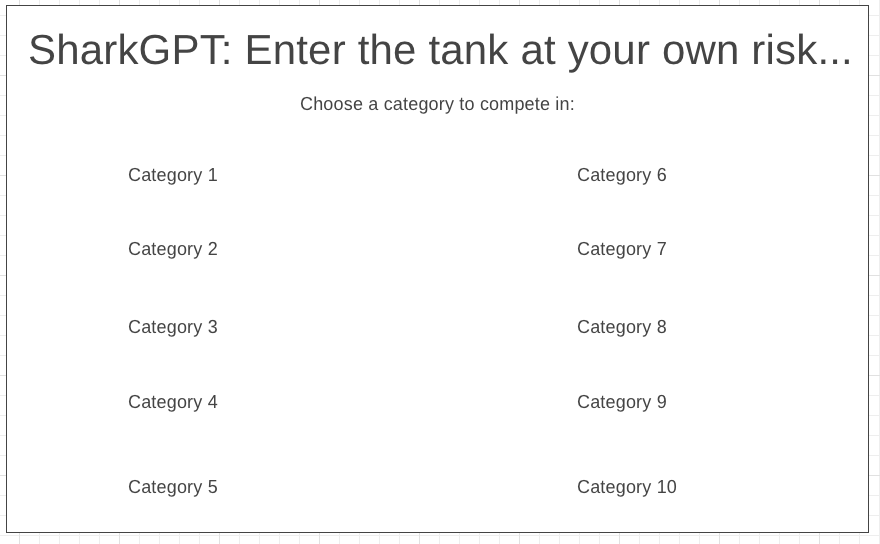
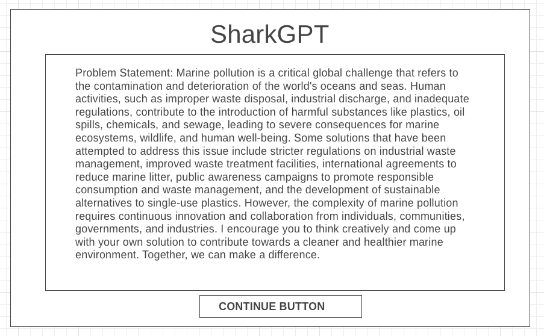
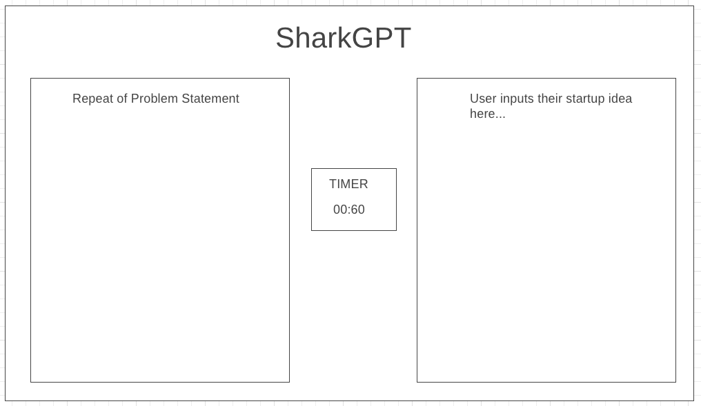
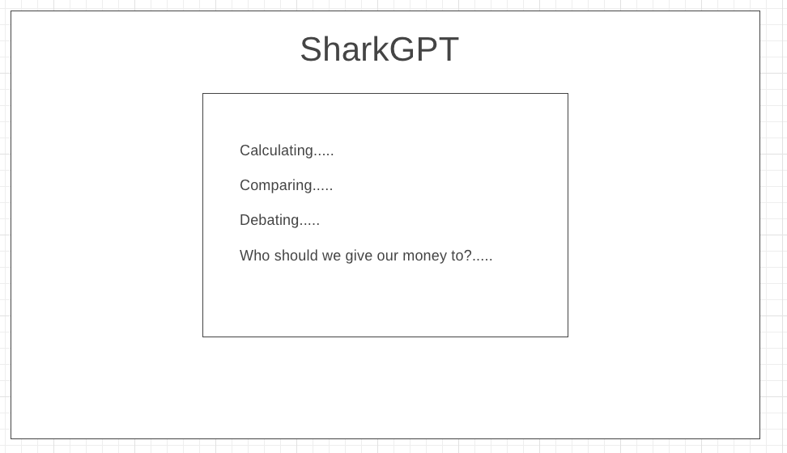
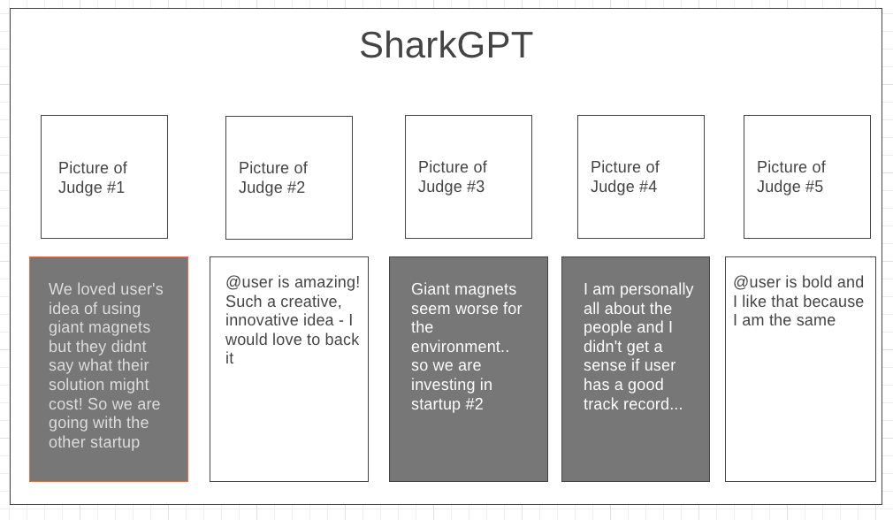

# Background

Welcome to **SharkTank: ChatGPT Version**! Pitch your crazy startup idea to our panel of rich & powerful investors. In the other room, there is another startup working on the same problem that is waiting to pitch to the same VCs. Can you come up with a better idea that will appeal to each investor? The prize at stake: a $10M Series A investment that will launch you on the gloried path to becoming a billion dollar unicorn company. 

# Functionality & MVPs

Users will be able to:

* Select a category to compete in
* View the investor panel (Elon Musk, Beyonce, Barack Obama, Michael Jordan, Warren Buffet, etc.)
* Write out a description of their idea in 60 seconds or less
* View the competing pitch (computer-generated)
* See how each investor rates their idea vs. the opponent's idea

In addition, this project will include: 

* A production README
* Step by step instructions 

# Wireframes

* #1: Welcome Screen

* #2: User reads a description of the problem in the category they selected

* #3: User has 60 seconds to write out their proposed solution

* #4: Rendering screen while API calls are made

* #5: Results

# Technologies, Libraries, APIs

This project will be implemented using:

* The Canvas API to render the board
* Webpack and Babel to bundle and transpile the source JavaScript code
* npm to manage project dependencies
* ChatGPT API to calculate the scores from each judge

# Implementation Timeline 

* Thursday & Friday: Setup project. Get canvas to show up on screen. Experiment with ChatGPT API and figure out how the user input will feed into the API. Will likely need some chained API calls to prime the GPT first with the judge's personality. Get the starting screen showing up.

* Monday: Flesh out the opposing pitch for each category. Will probably be hard-coded. Make sure that when both pitches are submitted to ChatGPT (pre-generated vs. user input), the judges are always picking a winner.

* Tuesday: Styling/building out each page and user controls. Make sure the pages are flowing in the correct order.

* Wednesday: Make it pretty. 

* Thursday morning: Deploy to GitHub pages.

# Bonus Features 

Eventually, it would be cool if this could be a 2 player game that is category-ambiguous, in order to simulate the real VC world a little better. 